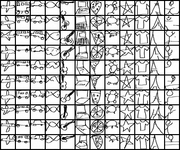

# Foundation of Generative Models Homework 2

Main Contributor: 易小鱼
Teammates: 易鼎程, 刘恺河

## Introduction

This homework implements an efficient CFG diffusion model that generates hand-drawing images conditioned on 12 class labels with only 6,586,369 model parameters and 100 diffusion steps.

The generation results is as follows:



The diffusion process is as follows:


## Quickstart

To use our pretrained weight to generate samples, first download our pretrained weights from , unzip `outputs.zip`, and then run the following command:

```bash
python src/sample.py
```

The code will load our best checkpoint at `outputs\ckpts\best.pth` and generate 120 images (10 images each class) under different guidance strength w=0.5, 2.0, 5.0, respectively. The generated images will be saved under subfolder `samples\guidance_{w}\{class label}`. For a better visulization, we also generate a image grid that contains all generated samples at `samples\guidance_{w}\grid.png`, and also a gif at `samples\guidance_{w}\process.gif` showing the diffusion process.

Empirically, we found that sampling results with w=5.0 are with the best quality. **Thus we recommend TAs to use the results under subfolder `samples\guidance_5.0` as the final results of our group used for cross-team evaluation.**

## Dive into training process

See `outputs` folder for our training results.

The checkpoints every 5 epochs and the best checkpoint are saved under subfolder `outputs\ckpts`.

To evaluate our model, we generate 4*12 images every epoch with different guidance strength and generation results can be found at `outputs\eval\image\image_ep{epoch num}_w{guidance strength}.png`. For a better visulization, we also generate a gif to show the diffusion process every 5 epochs and the gif can be found at `outputs\eval\gif\gif_ep{epoch num}_w{guidance strength}.gif`.

The training loss curve is saved under `outputs\logs`. If you would like to see the curve, run the following command (make sure tensorboard extension is installed):

```bash
tensorboard --logdir outputs/logs
```

If you would like to reproduce our training results from scratch, please download the training data from [here](https://disk.pku.edu.cn/anyshare/zh-cn/link/AAFBDF996C62914377A13FD9B9B239AD6C?_tb=none&expires_at=2025-02-01T10%3A48%3A48%2B08%3A00&item_type=file&password_required=false&title=subclass12-dataset&type=anonymous), unzip `subclass12.zip`, delete the `outputs` folder and run the following command:

```bash
python src/train.py
```

## Code implementation details

### Dataset

In `src\data_utils.py` is the code that loads training images and corresponding labels.

### UNet

In `src\unet.py` is the code that defines the UNet model. The UNet model takes as input batched images `x`, batched diffusion timesteps `t`, batched labels `c` and batched label mask `context_mask`, which is used to train unconditional model at the same time, and regresses to the added noise with the same shape as `x`.

### DDPM

In `src\diffusion.py` is the code that defines the DDPM model.

### Hyperparameters

All hyperparameters can be adjusted in `src\params.py`, though we do not recommend to do so.

### Training

The training process is defined in `src\train.py`. We implement a trainer that loads the dataset, initializes the model and optimizer, and performs training and evaluation, and also do logging every epoch using the hyperparameters defined in `src\params.py`.

### Sampling

The sampling process is defined in `src\sample.py`. We implement a sampler that loads the model and generates samples with different guidance strength.

## Division of Work

- **易小鱼**  
  Took charge of the technical implementation of the project, completing the following tasks:  
  - Wrote all the code and performed code debugging
  - Conducted all experiments including parameter tuning, model optimization and sample generation.


- **易鼎程，刘恺河**  
  Contributed to the project discussion and offered useful suggestions.

## Acknowledgement

This homework is based on and modified from [Conditional Diffusion MNIST](https://github.com/TeaPearce/Conditional_Diffusion_MNIST/blob/main/script.py). We thank the original authors for their excellent implementation of a minimal self-contained conditional diffusion model that generates MNIST digits conditioned on class labels.
